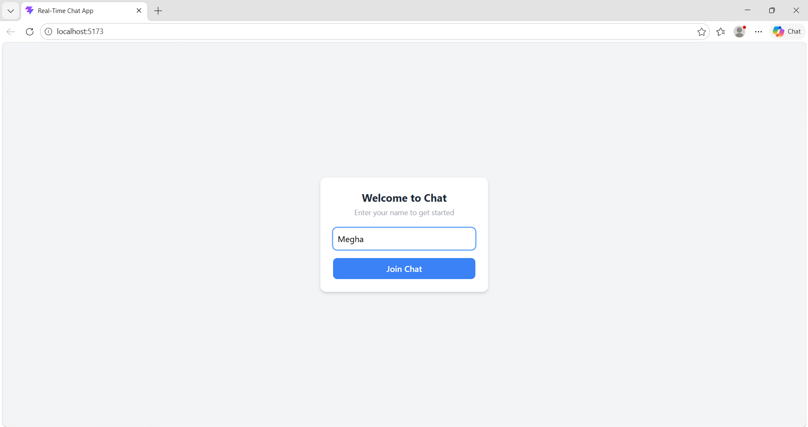
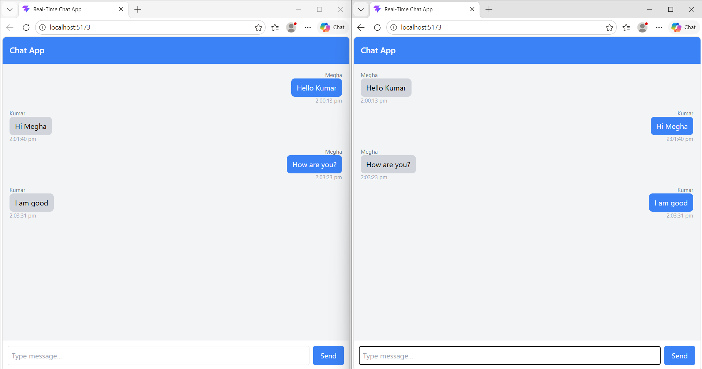
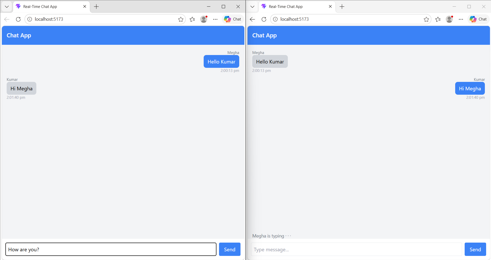

# 💬 Real-Time Chat Application

A full-stack real-time chat application built with **React, Node.js, Socket.IO, and Tailwind CSS**.  
Supports multiple users, live typing indicators, online user tracking, and join/leave notifications.

🔗 **Live Demo:** https://chat-app-megha-2003-devs-projects.vercel.app/

---

## 📸 Screenshots

### 🟢 Join Screen


### 💬 Chat Interface


### ✍️ Typing Indicator


---

## ✨ Features

- ⚡ Real-time messaging using WebSockets (Socket.IO)
- 🟢 Online users sidebar with live count
- ✍️ Typing indicator with debounce
- 📢 Join/leave system notifications
- 📱 Fully responsive UI with Tailwind CSS
- 🔄 Auto-scroll to latest message
- 🧩 Custom `useSocket` hook for clean separation of concerns
- 🔒 Environment-based configuration with `.env`

---

## 🛠️ Tech Stack

| Layer | Technologies |
|---|---|
| Frontend | React, Vite, Tailwind CSS, Socket.IO Client |
| Backend | Node.js, Express, Socket.IO |
| Deployment | Vercel (frontend), Render (backend) |

---

## 📁 Project Structure

```
chat-app/
├── client/
│   ├── src/
│   │   ├── components/
│   │   │   ├── MessageBubble.jsx   # Individual message component
│   │   │   └── OnlineUsers.jsx     # Online users sidebar
│   │   ├── hooks/
│   │   │   └── useSocket.js        # Custom hook for socket logic
│   │   ├── pages/
│   │   │   └── ChatPage.jsx        # Main chat UI
│   │   ├── socket.js               # Socket connection setup
│   │   └── App.jsx
├── server/
│   └── index.js                    # Express + Socket.IO backend
├── screenshots/
└── README.md
```

---

## ⚙️ Run Locally

### 1. Clone the repository
```bash
git clone https://github.com/megha-2003-dev/chat-app.git
cd chat-app
```

### 2. Setup Backend
```bash
cd server
npm install
```
Create a `.env` file in the `server` folder:
```
PORT=5000
```
```bash
node index.js
```

### 3. Setup Frontend
```bash
cd client
npm install
```
Create a `.env` file in the `client` folder:
```
VITE_SOCKET_URL=http://localhost:5000
```
```bash
npm run dev
```

---

## 📌 How It Works

- Users enter a username to join the chat
- On joining, all connected users are notified via a system message
- Messages are sent to the server and broadcast to all connected clients in real time
- Typing indicator fires a debounced socket event so other users see when someone is typing
- Online users list updates live as users join and leave
- On disconnect, a leave notification is broadcast and the online list updates

---

## 👩‍💻 Author

**Megha Sharma**  
GitHub: https://github.com/megha-2003-dev

---

⭐ If you found this project useful, consider giving it a star!
